# logibar

[](https://aur.archlinux.org/packages/logibar)
[](LICENSE)

logibar shows the battery level of your Logitech Lightspeed devices — keyboard, mouse and headset — in your status bar. It runs on Waybar and on the Omarchy shell (Quickshell). It reads each battery over HID++, and it does not need a daemon from the vendor. It refreshes when a device wakes, goes to sleep, or when a charge cycle begins.

The same core drives both frontends, so a number reads the same on either one:

| The Omarchy shell plugin | The Waybar module |
| :---: | :---: |
| 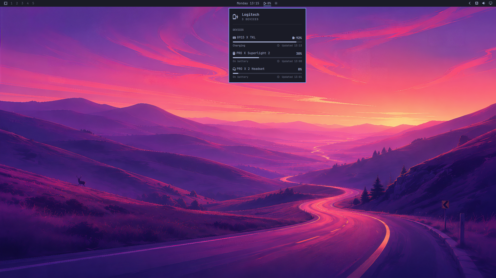 | 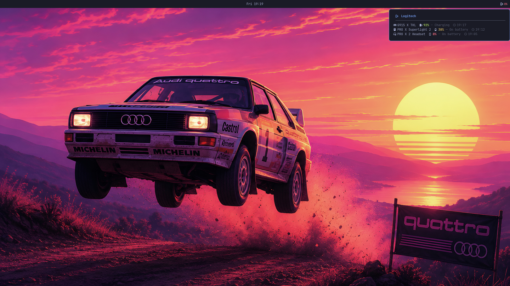 |

## Contents

- [Features](#features)
- [Supported devices](#supported-devices)
- [Requirements](#requirements)
- [Installation](#installation)
- [Quick start](#quick-start)
- [Omarchy shell plugin](#omarchy-shell-plugin)
- [Configuration](#configuration)
- [Structured JSON output](#structured-json-output)
- [How it works](#how-it-works)
- [Add a device](#add-a-device)
- [Troubleshooting](#troubleshooting)
- [Related](#related)

## Features

- **One widget for all devices.** The bar shows the battery of the device that needs attention first. One click or one hover shows the details of each device.
- **Event-driven.** Two small daemons listen for HID++ events. There is no polling loop. The bar refreshes when the hardware sends an event.
- **A real gauge.** The meters go from red at empty, through amber, to green at full. The colors come from your theme.
- **Two frontends, one brain.** `logibar-status` makes every decision. Waybar and the Omarchy plugin only draw the result.
- **Theme-aware.** The colors come from the active Omarchy theme, or from a pywal cache, or from a built-in palette.
- **Monochrome mode.** A flag or the `NO_COLOR` variable removes the colors. Then your own CSS gives the bar its style.
- **Structured JSON.** A documented output without colors for your own scripts.

## Supported devices

| Device | Type | Daemon |
|---|---|---|
| G915 TKL | Keyboard | `logibar-hidpp-monitor` |
| G915 X TKL | Keyboard | `logibar-hidpp-monitor` |
| PRO X Superlight | Mouse | `logibar-hidpp-monitor` |
| PRO X Superlight 2 | Mouse | `logibar-hidpp-monitor` |
| PRO X 2 LIGHTSPEED | Headset | `logibar-headset-monitor` |

Other Logitech Lightspeed devices need only a new entry in a table. The section [Add a device](#add-a-device) gives the procedure.

## Requirements

- Python 3
- **[`python-hidapi`](https://pypi.org/project/hidapi/)** — `pacman -S python-hidapi`, or `pip install hidapi`
- [`jq`](https://jqlang.github.io/jq/) — all the widget scripts use it
- [Waybar](https://github.com/Alexays/Waybar), or the Omarchy shell
- [`inotify-tools`](https://github.com/inotify-tools/inotify-tools) — only for `logibar-status --watch`
- A [Nerd Font](https://www.nerdfonts.com/) for the icons

> [!IMPORTANT]
> Install `python-hidapi`. Do not install `python-hid`. Both packages give you a module with the same name `hid`, but the API is different. If you install the wrong package, the daemons stop at the first device and write nothing. No error message appears, because the daemons continue to run. The widget stays empty.

### Device permissions

The daemons read and write `/dev/hidraw*`. The AUR package adds the rule for you. For a manual installation, add the rule yourself:

```bash
sudo tee /etc/udev/rules.d/70-logitech-hidraw.rules << 'EOF'
# Logitech HID++ devices — allow user access for battery monitoring
KERNEL=="hidraw*", ATTRS{idVendor}=="046d", MODE="0660", TAG+="uaccess"
EOF
sudo udevadm control --reload-rules && sudo udevadm trigger --action=change --subsystem-match=hidraw
```

> [!NOTE]
> The `70-` prefix is necessary. The rule must come before the `73-seat-late.rules` file of systemd, which applies the `uaccess` ACL. A higher number, such as `99-`, applies the tag too late, and you get no access. If you installed the rule as `99-logitech-hidraw.rules` before, delete it: `sudo rm /etc/udev/rules.d/99-logitech-hidraw.rules`.

## Installation

### Omarchy

On [Omarchy](https://omarchy.org), the complete installation is two commands:

```bash
yay -S logibar
omarchy plugin add https://github.com/mryll/logibar.git --enable
```

The first command installs the scripts, the udev rule and the two monitor services. The second command installs the bar widget and enables it. Refer to [Omarchy shell plugin](#omarchy-shell-plugin) for the panel and its settings.

### Arch Linux (AUR)

```bash
yay -S logibar
```

The package adds the udev rule and enables both services.

### From source

```bash
git clone https://github.com/mryll/logibar.git
cd logibar
make install PREFIX=~/.local
make install-systemd
sudo make install-udev
```

These commands install 4 widget scripts and 2 daemons in `~/.local/bin/`, 2 systemd user services, and the udev rule.

| Target | Result |
|---|---|
| `make install` | Widget scripts and daemons |
| `make install-systemd` | User services, enabled for the next login |
| `make install-udev` | The udev rule (needs root) |
| `make install-tools` | Debug tools for a new device |
| `make install-all` | Everything above, except the udev rule |
| `make install-omarchy` | The Omarchy shell plugin |
| `make test` | The test suite |

To remove any of them, use the same name with `uninstall`, such as `make uninstall PREFIX=~/.local`.

## Quick start

### Waybar: one module for every device

The bar shows the battery of the device with the lowest charge. The tooltip gives one block for each connected device: the device with its glyph, a level meter, and one line with the charge state and the time of that device's last reading.

The time is per device, not per tooltip. Each daemon writes its own device's reading at its own time, so a single "Updated" line would put the newest device's time next to every other device's older number.

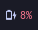
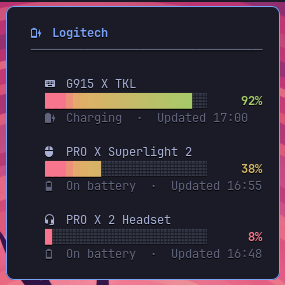

Add these lines to `~/.config/waybar/config.jsonc`:

```jsonc
"modules-right": ["custom/logibar", ...],

"custom/logibar": {
    "exec": "logibar-status --watch",
    "return-type": "json",
    "restart-interval": 5,
    "tooltip": true
}
```

Run `logibar-status --help` for the full reference: the usage line, every flag, and the format placeholders.

`--watch` prints a new line on each change, so the bar does not poll. This flag needs `inotify-tools`. Without that package, use `"exec": "logibar-status"` and select your own `"interval"`. To hide a device, give the names of the devices that you want: `--devices keyboard,mouse`.

### Waybar: one module per device

The three original modules still work, and they now share the colors of the combined module.


```jsonc
"modules-right": ["custom/logibar-keyboard", "custom/logibar-mouse", "custom/logibar-headset", ...],

"custom/logibar-keyboard": {
    "exec": "logibar-keyboard",
    "return-type": "json",
    "interval": "once",
    "signal": 9,
    "tooltip": true
},
"custom/logibar-mouse": {
    "exec": "logibar-mouse",
    "return-type": "json",
    "interval": "once",
    "signal": 10,
    "tooltip": true
},
"custom/logibar-headset": {
    "exec": "logibar-headset",
    "return-type": "json",
    "interval": "once",
    "signal": 8,
    "tooltip": true
}
```

> [!NOTE]
> These modules use `"interval": "once"`. The daemons send `SIGRTMIN+N` to Waybar after each change, so a polling interval is not necessary.

## Omarchy shell plugin

The plugin in [`omarchy/`](omarchy/) is a native widget for the bar of the [Omarchy](https://github.com/basecamp/omarchy) shell. The face of the bar shows the same short summary as Waybar. A click opens a panel with one row for each device. The row shows the name, an animated battery meter, the charge, the charging state, and the time of the last update.

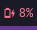

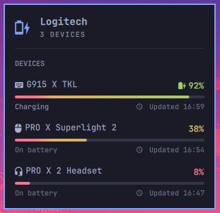

Install the plugin, then add it to your bar:

### Install the plugin

From the marketplace, or from this repository directly:

```bash
omarchy plugin add https://github.com/mryll/logibar.git --enable
```

That clones the repository into `~/.config/omarchy/plugins/mryll.logibar` and
validates the manifest before it is enabled. To remove it later:
`omarchy plugin remove mryll.logibar`.

The plugin runs `logibar-status` from your PATH and needs the battery daemons, so install those too — from the AUR (`yay -S logibar`) or with `make install-all PREFIX=~/.local`.

For development, link the working copy instead of cloning a second one:

```bash
make install-omarchy
```

```json
"right": [
    { "id": "mryll.logibar" },
    ...
]
```

The command links this repository into `~/.config/omarchy/plugins/mryll.logibar`. The plugin needs `logibar-status` and both daemons. Install them first.

| Setting | Type | Default | Result |
|---|---|---|---|
| `colorMode` | enum | `full` | Where the colors appear: `full`, `none`, `bar-only`, `panel-only` |
| `showKeyboard` | boolean | `true` | Includes the keyboard |
| `showMouse` | boolean | `true` | Includes the mouse |
| `showHeadset` | boolean | `true` | Includes the headset |

Mouse buttons: **left** opens the panel, **middle** refreshes the panel. The widget disappears when no device is connected.

> [!TIP]
> After you edit a file in `omarchy/`, run `omarchy restart shell`. A rescan of the plugins does not compile the QML again.

The plugin also answers the shell's IPC, so a keybind or a script can drive it without the mouse:

```bash
qs ipc call mryll.logibar toggle    # open or close the panel
qs ipc call mryll.logibar refresh   # fetch now, without opening anything
```

## Configuration

### Colors

The battery charge has three levels:

| Class | Range | Color |
|---|---|---|
| `normal` | above 20% | green |
| `warning` | 11–20% | yellow |
| `critical` | 1–10% | red |

To use your own colors, add the flags to the `exec` line:

```jsonc
"custom/logibar": {
    "exec": "logibar-status --watch --color-normal '#50fa7b' --color-critical '#ff5555'",
    ...
}
```

The flags are `--color-normal`, `--color-warning` and `--color-critical`. Each flag takes a hex color, such as `#50fa7b`, `#5f7` or `#50fa7bff`. Waybar also receives the class name, so you can give the module a style in `~/.config/waybar/style.css` instead.

### Theming

The colors come from the first source in this list that has them:

1. The `--color-*` flags.
2. The active Omarchy theme, at `$XDG_STATE_HOME/omarchy/current/theme/colors.toml`. Older versions of Omarchy keep the theme at `~/.config/omarchy/current/theme/colors.toml`, and that path also works.
3. A pywal cache, at `$XDG_CACHE_HOME/wal/colors.json`. This source applies only when there is no Omarchy theme.
4. The built-in One Dark palette.

The pywal file is a standard in practice. The original [pywal](https://github.com/dylanaraps/pywal) has no maintainer now, but [pywal16](https://github.com/eylles/pywal16) writes the same file, and [wallust](https://codeberg.org/explosion-mental/wallust) has a target that is compatible with pywal. logibar reads `special.foreground`, `special.background`, and the colors `color1` (red), `color2` (green), `color3` (yellow) and `color4` (accent).

The same colors reach both frontends, in every theme:

| Flexoki Light | Rosé Pine | Hackerman |
|:---:|:---:|:---:|
| 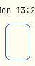 | 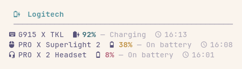 | 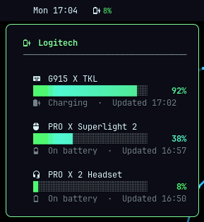 |
| 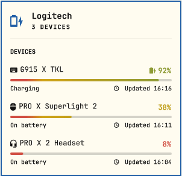 | 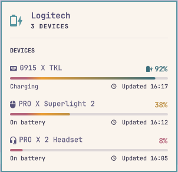 | 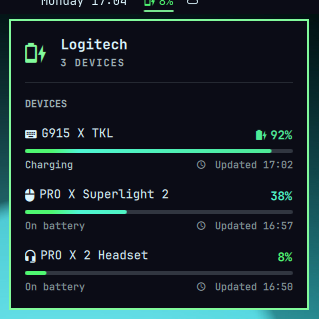 |

| Ristretto | Nord | Kanagawa |
|:---:|:---:|:---:|
| 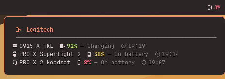 | 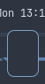 | 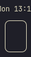 |
| 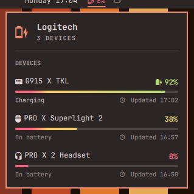 | 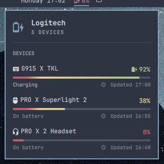 | 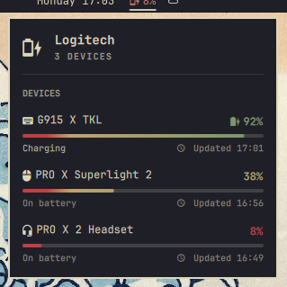 |

> [!NOTE]
> **Earlier versions did not detect the theme.** The widgets looked for the theme in the old path. They also looked for a `color1` key that current themes do not write. The failure was silent. The tooltips used the built-in palette. The colors now follow your theme.

### Monochrome mode

For a bar without colors, use `--no-color`:

```bash
logibar-status --no-color            # the same as --no-color=all
logibar-status --no-color=bar        # a plain bar, a colored tooltip
logibar-status --no-color=tooltip    # a colored bar, a plain tooltip
```

| Command | Bar text | Tooltip |
|---|---|---|
| none | colored | colored |
| `--no-color` or `--no-color=all` | plain | plain |
| `--no-color=bar` | plain | colored |
| `--no-color=tooltip` | colored | plain |

The [`NO_COLOR`](https://no-color.org) environment variable does the same as `--no-color=all`, if the value is not empty. A flag on the command line is more exact, so the flag has priority: `NO_COLOR=1 logibar-status --no-color=bar` keeps the colors in the tooltip.

Icons, meters, borders and bold text stay. Only the colors disappear.

| Waybar tooltip | Omarchy panel |
|---|---|
| 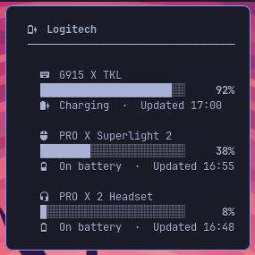 | 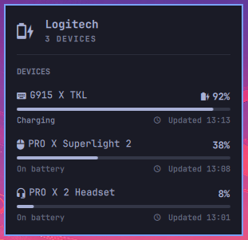 |

The Omarchy plugin has the same four states in its `colorMode` setting.

> [!TIP]
> Waybar still receives the class name for each level. Remove the colors and write your own rules:
> ```css
> #custom-logibar.warning  { color: #d79921; }
> #custom-logibar.critical { color: #cc241d; font-weight: bold; }
> ```

### Tooltip font

The tooltip is pinned to a monospace font. That is not decoration: its rules are box-drawing characters, and in a proportional font one of those is nearly twice as wide as a letter. The tooltip then sizes itself to the rules, and a dead margin opens to the right of the text. Waybar draws the tooltip in a GTK window that ignores `font-family` from your CSS, so the markup is the only place this can be said.

The default is a **list** of families, tried in order:

```
JetBrainsMono Nerd Font Mono, JetBrainsMono Nerd Font, monospace
```

Pango falls through to the next name when one is not installed. This matters: the Arch package `ttf-jetbrains-mono-nerd` does **not** ship the `…Mono` family, so pinning that one name alone used to fall back to your system's proportional font without saying so.

To use a different font, name any monospace family (or your own list):

```bash
logibar-status --tooltip-font "FiraCode Nerd Font Mono"
```

> [!NOTE]
> **`--frame` and `--frame-font` are deprecated.** `--frame` drew the tooltip as a bordered card. It is still accepted, so an existing Waybar config keeps working, but it now does nothing; `--frame-font` is an alias for `--tooltip-font`.
>
> The box was a second way of drawing the same content — more code, more documentation, more screenshots — and it only lined up when the pinned font was a complete Mono Nerd Font. Pinning the font on the one remaining tooltip gives the alignment without the box.

### Spacing

Change `padding` and `margin` in `~/.config/waybar/style.css`:

```css
#custom-logibar {
    padding: 0 8px;
    margin: 0 4px;
}
```

## Structured JSON output

`logibar-status --json` prints the data behind the widget. Use this output in your own scripts, or read it to see the same data as the widget. The command always exits with 0, and the output contains no colors and no markup.

```json
{
  "schema_version": 1,
  "devices": [
    { "id": "keyboard", "name": "G915 TKL", "battery": 92, "connected": true,
      "charging": true, "state": "ok", "updated_at": "2026-08-20T02:21:04-03:00" }
  ],
  "aggregate": { "worst_battery": 8, "any_charging": true, "connected_count": 3, "state": "critical" },
  "palette": {
    "ok": "#9ece6a", "warning": "#e0af68", "critical": "#f7768e",
    "accent": "#7aa2f7", "foreground": "#a9b1d6", "background": "#1a1b26",
    "thresholds": { "warning": 20, "critical": 10 },
    "stops": [
      { "pct": 0, "color": "#f7768e" }, { "pct": 10, "color": "#f7768e" },
      { "pct": 20, "color": "#e0af68" }, { "pct": 100, "color": "#9ece6a" }
    ]
  }
}
```

| Field | Meaning |
|---|---|
| `devices[].state` | `ok`, `warning`, `critical`, or `disconnected` |
| `devices[].updated_at` | The time when the daemon last wrote this device, in ISO-8601 |
| `aggregate` | The device with the lowest charge, and the state of the group |
| `palette` | The colors of the gauge, after the theme and the flags |
| `palette.stops` | The gauge, as colors and the percentages where they apply |

An error is also a JSON document, with an `error` field and the same exit code 0. Programs that read this output do not parse text.

> [!NOTE]
> `palette.stops` is the reason why one change of a threshold moves both frontends. `logibar-status` keeps the numbers, and the Omarchy panel interpolates between the stops that it receives. `--no-color` has no effect on this output.

## How it works

### Architecture

```
┌──────────────────────┐   state files    ┌──────────────────┐
│  logibar-hidpp-      │──→ keyboard,mouse│                  │
│  monitor (Python)    │  ($XDG_RUNTIME_  │ logibar-status   │──→ Waybar
├──────────────────────┤   DIR/logibar/)  │ logibar-keyboard │
│  logibar-headset-    │──→ headset ─────→│ logibar-mouse    │──→ Omarchy shell
│  monitor (Python)    │                  │ logibar-headset  │
└──────────────────────┘                  └──────────────────┘
```

1. The **daemons** run as systemd user services and monitor the HID devices.
2. The daemon writes each change to a **state file** in `$XDG_RUNTIME_DIR/logibar/`, in 3 lines: `battery`, `connected`, `charging`. Each of these operations is atomic, so a reader never gets half of a file.
3. **`logibar-status`** reads these files. It selects the worst device, applies the thresholds, finds the colors, and prints the result.
4. For Waybar, the daemons also send `SIGRTMIN+N`. For the Omarchy shell, the plugin monitors the files and runs `logibar-status` again after each change.

### Keyboard and mouse: HID++ 2.0

`logibar-hidpp-monitor` uses the standard **Logitech HID++ 2.0** protocol. [Solaar](https://github.com/pwr-Solaar/Solaar) uses the same protocol, but logibar sends the commands directly to hidapi, with no extra daemon.

Each device has two product IDs: one for the Lightspeed receiver and one for the USB cable. One thread monitors each product ID, and a shared state selects the live connection. The cable has priority.

To read most batteries, the daemon asks the ROOT feature at index `0x00` for the index of the UNIFIED_BATTERY feature (`0x1004`). Then it asks that feature for the charge:

```
Request:  [0x10, device_idx, 0x00, 0x0d, 0x10, 0x04, 0x00]
                  │             │     │     └─── feature ID 0x1004
                  │             │     └──── function 0 (getFeatureIndex) + SW ID
                  │             └───── ROOT feature is always at index 0
                  └──────────── 0x01 for wireless (via receiver), 0xFF for wired (direct USB)
Response: [0x10, device_idx, 0x00, 0x0d, feature_index, ...]

Request:  [0x11, device_idx, feature_index, 0x1d, 0x00, ..., 0x00]
Response: [0x11, device_idx, feature_index, 0x1d, SoC, level, status, ...]
                                                   │     │      └── 1=charging, 2=slow, 3=full
                                                   │     └── level flags
                                                   └── State of Charge (0-100%)
```

Byte 3 of a request is `(function << 4) | software_id`. hidraw copies every response to every open descriptor on a node, so each requester in the daemon signs with its own software ID (`0xD` for the battery monitors, `0xE` for the device-kind probe) and accepts only a response with its full echo. Broadcast events carry software ID `0`.

The G915 TKL instead exposes BATTERY_VOLTAGE (`0x1001`). Its query is function 0 (request byte `0x0d`), and the response contains a two-byte millivolt reading and charging flags. Logibar converts that voltage to a percentage using the same discharge curve as Solaar. A drained cell converts to `0%`, which the widgets show as a critical reading — only `connected` decides visibility.

After the first request, the daemon blocks on the device with a timeout of one second. The receiver sends a message after each change of the state:

- **Connection events** (`0x41`) — the device wakes, goes to sleep, or disconnects. Bit 6 of byte 4 is the `link_off` flag.
- **Battery events** — the device reports a new charge, or the start or the end of a charge cycle.

### Headset: a vendor protocol

The PRO X 2 LIGHTSPEED does not answer the UNIFIED_BATTERY feature. It needs a vendor command. The scripts in [`tools/`](tools/) helped to find that command. The headset also uses the HID usage page `0xffa0`, not `0xff00`.

```
Battery request:  51 08 00 03 1a 00 03 00 04 0a [00 * 54]
Battery response: 51 0b XX XX XX XX XX XX 04 XX battery_pct XX charging_status ...
                   │  │                    │     │              └── 0x02 = charging
                   │  │                    │     └── battery percentage (1-100)
                   │  │                    └── response type marker (0x04)
                   │  └── response identifier (0x0b)
                   └── report ID (0x51)

Power event:      51 05 00 03 00 00 XX 00
                                     └── 0x00 = off, 0x01 = on
```

The headset reports each power event, but it does not report a new charge without a request. For this reason, the daemon asks for the charge every 60 seconds while the headset has power. It also asks immediately after a power-on event.

## Add a device

To add another Logitech device to the keyboard and mouse daemon:

1. Find the two product IDs of the device, one for the wireless connection and one for the cable:

   ```bash
   lsusb | grep 046d
   ```

2. Add a line to the `DEVICES` list in `logibar-hidpp-monitor`:

   ```python
   DEVICES = [
       (0xc545, 0xc343, "keyboard", 9),   # G915 TKL
       (0xc547, 0xc357, "keyboard", 9),   # G915 X TKL
       (0xc547, 0xc094, "mouse", 10),     # PRO X Superlight
       (0xc54d, 0xc09b, "mouse", 10),     # PRO X Superlight 2
       (0xNEW1, 0xNEW2, "newdevice", 11), # Your device
   ]
   ```

   Devices use UNIFIED_BATTERY (`0x1004`) by default. If the device instead exposes BATTERY_VOLTAGE (`0x1001`), add its receiver PID to `BATTERY_FEATURE_BY_RECEIVER`.

3. Add the device to `DEVICE_IDS`, `DEVICE_ICON` and `DEVICE_NAME` in `logibar-status`.

4. To make a module for one device, copy `logibar-keyboard`, then set new values for `ICON`, `TOOLTIP` and `STATE_FILE`. Give the new Waybar module the same signal number as the daemon.

> [!TIP]
> The [`tools/`](tools/) directory helps you to find the correct IDs:
> - `logibar-hidpp-battery <hidraw_device>` — reads the battery of any HID++ 2.0 device
> - `logibar-hidpp-debug <hidraw_device>` — the same, but it prints each step and tries several device indexes
> - `logibar-headset-probe` — lists the features that a device answers

## Troubleshooting

| Symptom | Cause | Solution |
|---|---|---|
| The widget never appears | The daemon does not run | `systemctl --user status logibar-hidpp-monitor` |
| The widget appears, then stays empty | The wrong `hid` package | Install `python-hidapi`, remove `python-hid`, then restart the services |
| The widget is empty | The device has no power, or it is asleep | Set the power switch to on, or press a key |
| `Permission denied` in the journal | No access to `hidraw` | Add the [udev rule](#device-permissions) |
| The charge stays the same | The state file is old | `systemctl --user restart logibar-hidpp-monitor` |
| The Omarchy widget shows a warning sign | `logibar-status` is not on PATH | `make install PREFIX=~/.local` |
| A change in `omarchy/` does nothing | The QML is still the old version | `omarchy restart shell` |

To read the logs of the daemons:

```bash
journalctl --user -u logibar-hidpp-monitor -f
journalctl --user -u logibar-headset-monitor -f
```

To see the state of every device at once:

```bash
logibar-status --json | jq
```

## Related

- [claudebar](https://github.com/mryll/claudebar) — Claude AI plan usage
- [codexbar](https://github.com/mryll/codexbar) — OpenAI Codex subscription usage
- [meteobar](https://github.com/mryll/meteobar) — the weather, from Open-Meteo
- [printbar](https://github.com/mryll/printbar) — any printer: supplies, trays and queue
- [tickerbar](https://github.com/mryll/tickerbar) — prices of crypto, stocks, indices, commodities and forex
- [Omarchy](https://github.com/basecamp/omarchy) — the Linux setup for these widgets
- [Waybar](https://github.com/Alexays/Waybar) — the status bar for Wayland
